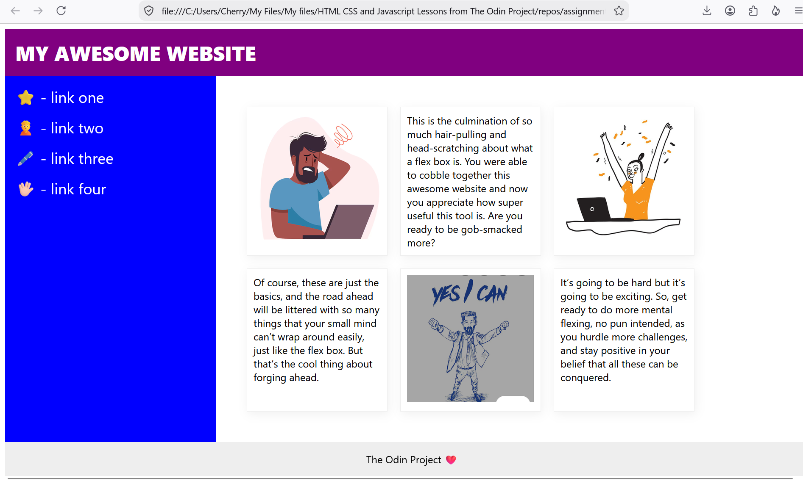

### Description

This is NOT an automation testing practice. This is a web development practice assignment from The Odin Project. The outcome can be viewed here https://mypracticesautomationtesting.github.io/WebDevelopmentTOPFlex7/

Using HTML and CSS with VSCode.

I took liberties to the assignment by replacing the text placeholders with images and my own text. 

Thank you to The Odin Project.

Images are free and taken from the awesome website www.magnific.com. Credits:

<a href="https://www.magnific.com/free-vector/portrait-excited-young-girl-with-laptop-computer-celebrating-success_13923470.htm">Image by iwat1929 on Magnific

a href="https://www.magnific.com/free-vector/business-man-with-text-yes-i-can-hand-draw-sketch-illustration-design_30832338.htm">Image by Rochak Shukla on Magnific

